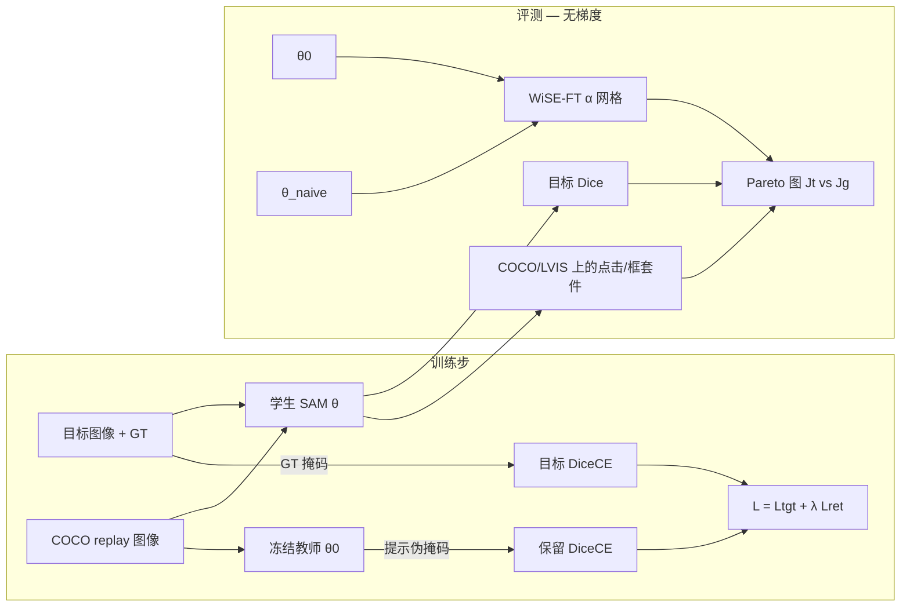

# RetainSAM 架构


```mermaid
flowchart LR
  subgraph train [训练步]
    Xt[目标图像 + GT] --> SAM_S[学生 SAM θ]
    Xr[COCO replay 图像] --> SAM_S
    Xr --> SAM_T[冻结教师 θ0]
    SAM_T -->|提示伪掩码| Lret[保留 DiceCE]
    Xt -->|GT 掩码| Ltgt[目标 DiceCE]
    Ltgt --> L[L = Ltgt + λ Lret]
    Lret --> L
  end
  subgraph eval [评测 — 无梯度]
    SAM_S --> Jt[目标 Dice]
    SAM_S --> Jg[COCO/LVIS 上的点击/框套件]
    Theta0[θ0] --> Wise[WiSE-FT α 网格]
    Naive[θ_naive] --> Wise
    Wise --> Pareto[Pareto 图 Jt vs Jg]
    Jt --> Pareto
    Jg --> Pareto
  end
```

```
权重插值（kill 开关基线）：
  θ(α) = (1-α) θ_SAM + α θ_naive

约束（我们主张与其不等价）：
  min_θ  L_tgt(θ)  s.t.  J_gen(θ) ≥ J_gen(θ0) - ε
  实现为 replay 蒸馏 + 可选的 λ 爬坡。
```
