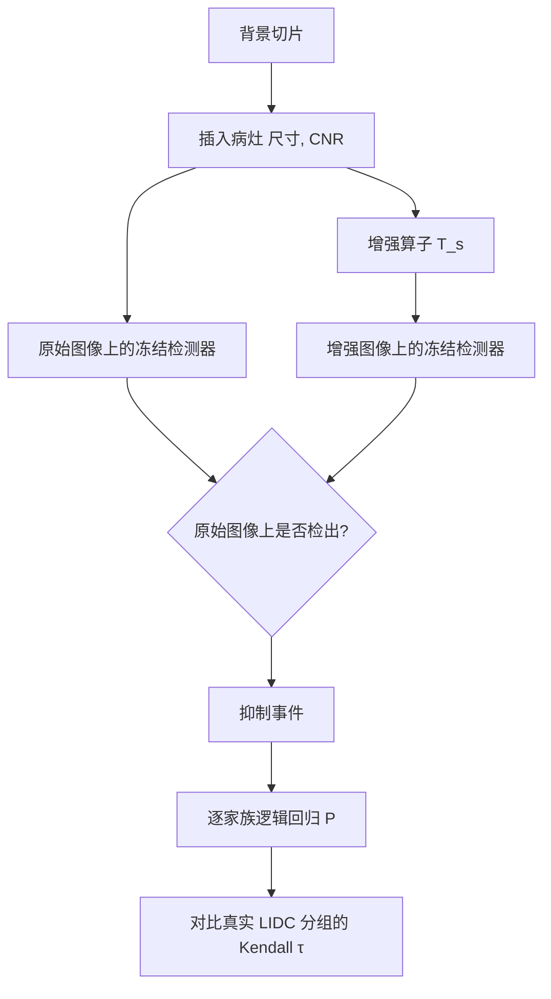

# LesionSuppress 架构

```mermaid
flowchart TB
  BG[背景切片] --> Ins[插入病灶 尺寸, CNR]
  Ins --> T[增强算子 T_s]
  Ins --> D0[原始图像上的冻结检测器]
  T --> D1[增强图像上的冻结检测器]
  D0 --> Cmp{原始图像上是否检出?}
  D1 --> Cmp
  Cmp --> S[抑制事件]
  S --> Fit[逐家族逻辑回归 P]
  Fit --> Tau[对比真实 LIDC 分组的 Kendall τ]
```
