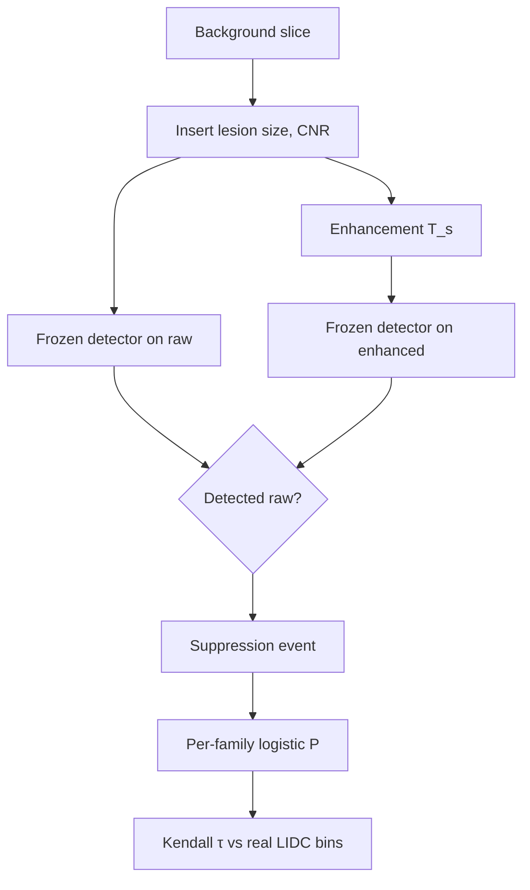

# LesionSuppress

```mermaid
flowchart TB
  BG[Background slice] --> Ins[Insert lesion size, CNR]
  Ins --> T[Enhancement T_s]
  Ins --> D0[Frozen detector on raw]
  T --> D1[Frozen detector on enhanced]
  D0 --> Cmp{Detected raw?}
  D1 --> Cmp
  Cmp --> S[Suppression event]
  S --> Fit[Per-family logistic P]
  Fit --> Tau[Kendall τ vs real LIDC bins]
```
