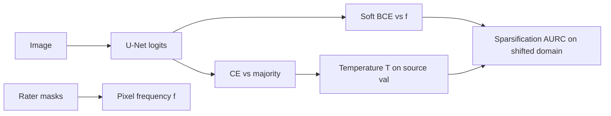

# DisagreeShift

```mermaid
flowchart LR
  X[Image] --> UNet[U-Net logits]
  R[Rater masks] --> F[Pixel frequency f]
  UNet --> Soft[Soft BCE vs f]
  UNet --> Hard[CE vs majority]
  Hard --> TS[Temperature T on source val]
  Soft --> AURC[Sparsification AURC on shifted domain]
  TS --> AURC
```
