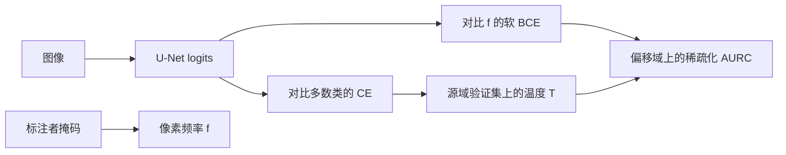

# DisagreeShift 架构

```mermaid
flowchart LR
  X[图像] --> UNet[U-Net logits]
  R[标注者掩码] --> F[像素频率 f]
  UNet --> Soft[对比 f 的软 BCE]
  UNet --> Hard[对比多数类的 CE]
  Hard --> TS[源域验证集上的温度 T]
  Soft --> AURC[偏移域上的稀疏化 AURC]
  TS --> AURC
```
