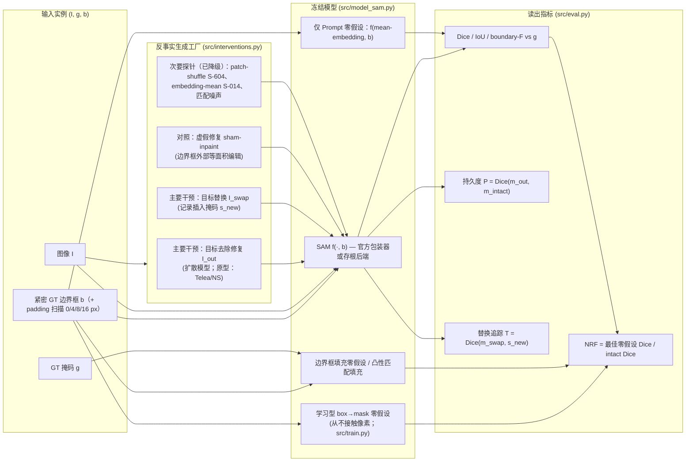
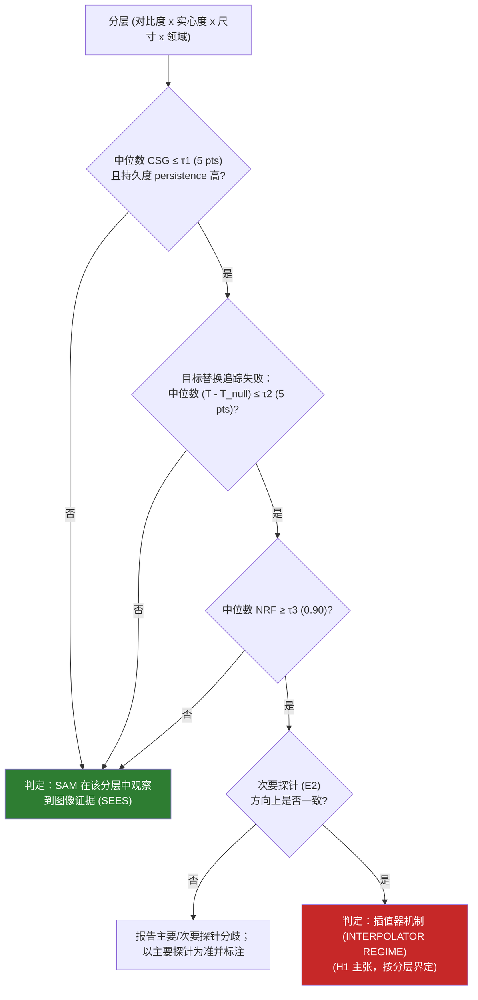
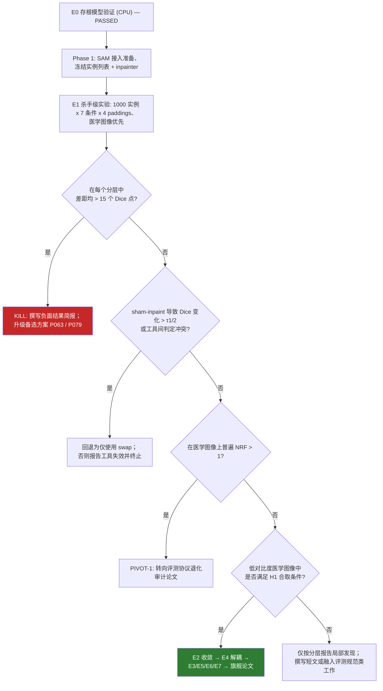
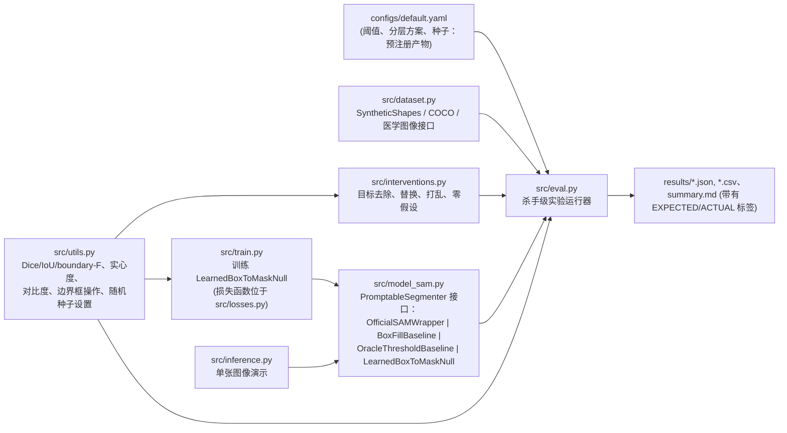

# SeeingInside — 架构图（Architecture Diagrams）

## 1. 测量流水线（逐实例）

```mermaid
flowchart LR
    subgraph INPUT["输入实例 (I, g, b)"]
        I["图像 I"]
        G["GT 掩码 g"]
        B["紧密 GT 边界框 b（+ padding 扫描 0/4/8/16 px）"]
    end

    subgraph CF["反事实生成工厂 (src/interventions.py)"]
        direction TB
        OUT["主要干预：目标去除修复 I_out<br/>(扩散模型；原型：Telea/NS)"]
        SWAP["主要干预：目标替换 I_swap<br/>(记录插入掩码 s_new)"]
        SHAM["对照：虚假修复 sham-inpaint<br/>(边界框外部等面积编辑)"]
        SEC["次要探针（已降级）：patch-shuffle S-604、<br/>embedding-mean S-014、匹配噪声"]
    end

    subgraph MODELS["冻结模型 (src/model_sam.py)"]
        SAM["SAM f(·, b) — 官方包装器<br/>或存根后端"]
        PO["仅 Prompt 零假设：f(mean-embedding, b)"]
        LN["学习型 box→mask 零假设<br/>(从不接触像素；src/train.py)"]
        BF["边界框填充零假设 / 凸性匹配填充"]
    end

    subgraph READ["读出指标 (src/eval.py)"]
        M1["Dice / IoU / boundary-F vs g"]
        M2["持久度 P = Dice(m_out, m_intact)"]
        M3["替换追踪 T = Dice(m_swap, s_new)"]
        M4["NRF = 最佳零假设 Dice / intact Dice"]
    end

    I --> CF
    B --> SAM
    I --> SAM
    OUT --> SAM
    SWAP --> SAM
    SHAM --> SAM
    SEC --> SAM
    B --> PO
    B --> LN
    B --> BF
    G --> BF
    SAM --> M1 & M2 & M3
    PO --> M1
    LN --> M4
    BF --> M4
    M1 --> M4
```

## 2. 判定逻辑（按分层预注册的合取条件）

```mermaid
flowchart TD
    S["分层 (对比度 x 实心度 x 尺寸 x 领域)"] --> C1{"中位数 CSG &le; &tau;1 (5 pts)<br/>且持久度 persistence 高?"}
    C1 -- 否 --> SEES["判定：SAM 在该分层中观察到图像证据 (SEES)"]
    C1 -- 是 --> C2{"目标替换追踪失败：<br/>中位数 (T - T_null) &le; &tau;2 (5 pts)?"}
    C2 -- 否 --> SEES
    C2 -- 是 --> C3{"中位数 NRF &ge; &tau;3 (0.90)?"}
    C3 -- 否 --> SEES
    C3 -- 是 --> C4{"次要探针 (E2)<br/>方向上是否一致?"}
    C4 -- 否 --> DISC["报告主要/次要探针分歧；<br/>以主要探针为准并标注"]
    C4 -- 是 --> INTERP["判定：插值器机制 (INTERPOLATOR REGIME)<br/>(H1 主张，按分层界定)"]

    style INTERP fill:#c62828,color:#fff
    style SEES fill:#2e7d32,color:#fff
```

## 3. 项目决策树（源自 roadmap.md）

```mermaid
flowchart TD
    E0["E0 存根模型验证 (CPU) — PASSED"] --> P1["Phase 1: SAM 接入准备、<br/>冻结实例列表 + inpainter"]
    P1 --> E1["E1 杀手级实验: 1000 实例 x 7 条件 x 4 paddings、<br/>医学图像优先"]
    E1 --> K{"在每个分层中<br/>差距均 > 15 个 Dice 点?"}
    K -- 是 --> DEAD["KILL: 撰写负面结果简报；<br/>升级备选方案 P063 / P079"]
    K -- 否 --> IK{"sham-inpaint 导致 Dice 变化 > &tau;1/2<br/>或工具间判定冲突?"}
    IK -- 是 --> FB["回退为仅使用 swap；<br/>否则报告工具失效并终止"]
    IK -- 否 --> PV{"在医学图像上普遍 NRF > 1?"}
    PV -- 是 --> PIVOT["PIVOT-1: 转向评测协议退化审计论文"]
    PV -- 否 --> H1{"低对比度医学图像中<br/>是否满足 H1 合取条件?"}
    H1 -- 是 --> PROG["E2 收敛 &rarr; E4 解耦 &rarr;<br/>E3/E5/E6/E7 &rarr; 旗舰论文"]
    H1 -- 否 --> PARTIAL["仅按分层报告局部发现；<br/>撰写短文或融入评测规范类工作"]

    style DEAD fill:#c62828,color:#fff
    style PROG fill:#2e7d32,color:#fff
```

## 4. 原型代码结构布局

```mermaid
flowchart LR
    CFG["configs/default.yaml<br/>(阈值、分层方案、种子：<br/>预注册产物)"] --> EV
    DS["src/dataset.py<br/>SyntheticShapes / COCO / 医学图像接口"] --> EV["src/eval.py<br/>杀手级实验运行器"]
    IV["src/interventions.py<br/>目标去除、替换、打乱、零假设"] --> EV
    MD["src/model_sam.py<br/>PromptableSegmenter 接口：<br/>OfficialSAMWrapper | BoxFillBaseline |<br/>OracleThresholdBaseline | LearnedBoxToMaskNull"] --> EV
    TR["src/train.py<br/>训练 LearnedBoxToMaskNull<br/>(损失函数位于 src/losses.py)"] --> MD
    UT["src/utils.py<br/>Dice/IoU/boundary-F、实心度、<br/>对比度、边界框操作、随机种子设置"] --> EV & IV & TR
    EV --> OUTS["results/*.json, *.csv、<br/>summary.md (带有 EXPECTED/ACTUAL 标签)"]
    INF["src/inference.py<br/>单张图像演示"] --> MD
```
