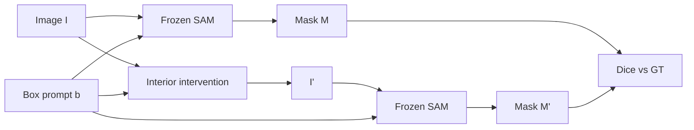

# SeeingInside data flow

```mermaid
flowchart LR
  I[Image I] --> SAM[Frozen SAM]
  B[Box prompt b] --> SAM
  SAM --> M[Mask M]
  I --> INT[Interior intervention]
  B --> INT
  INT --> Ip[I']
  Ip --> SAM2[Frozen SAM]
  B --> SAM2
  SAM2 --> Mp[Mask M']
  M --> D[Dice vs GT]
  Mp --> D
```

Nulls: ellipse-in-box and box-fill do not call the encoder.
