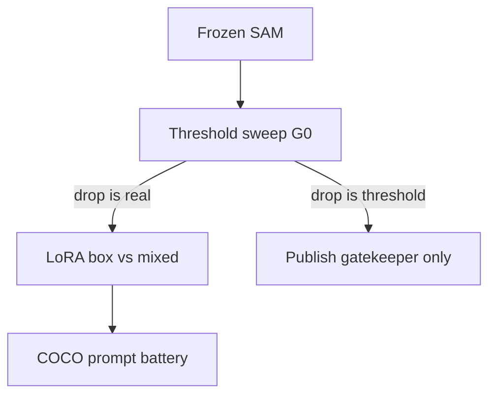

```mermaid
flowchart TB
  SAM0[Frozen SAM] --> G0[Threshold sweep G0]
  G0 -->|drop is real| FT[LoRA box vs mixed]
  G0 -->|drop is threshold| PIVOT[Publish gatekeeper only]
  FT --> Eval[COCO prompt battery]
```
