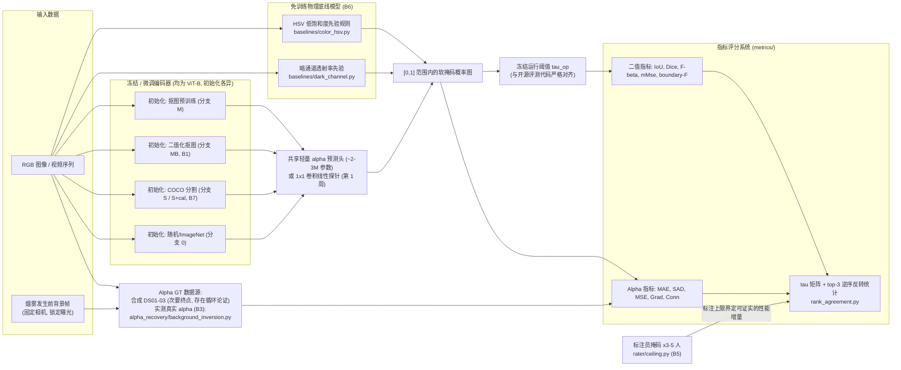

# AlphaSmoke — 架构级原理图

配套架构图：完整的实验概览详见 `../proposal.md` §6；预注册决策树详见 `../experiments.md` §3。

```mermaid
flowchart LR
    subgraph INPUT["输入数据"]
        RGB["RGB 图像 / 视频序列"]
        BG["烟雾发生前背景帧<br/>(固定相机, 锁定曝光)"]
    end

    subgraph FLOORS["免训练物理底线模型 (B6)"]
        HSV["HSV 低饱和度先验规则<br/>baselines/color_hsv.py"]
        DC["暗通道透射率先验<br/>baselines/dark_channel.py"]
    end

    subgraph ENCODERS["冻结 / 微调编码器 (均为 ViT-B, 初始化各异)"]
        EM["初始化: 抠图预训练 (分支 M)"]
        EMB["初始化: 二值化抠图 (分支 MB, B1)"]
        ES["初始化: COCO 分割 (分支 S / S+cal, B7)"]
        E0["初始化: 随机/ImageNet (分支 0)"]
    end

    HEAD["共享轻量 alpha 预测头 (~2-3M 参数)<br/>或 1x1 卷积线性探针 (第 1 周)"]
    SOFT["[0,1] 范围内的软掩码概率图"]
    THR["冻结运行阈值 tau_op<br/>(与开源评测代码严格对齐)"]

    subgraph SCORING["指标评分系统 (metrics/)"]
        BIN["二值指标: IoU, Dice, F-beta, mMse, boundary-F"]
        ALP["Alpha 指标: MAE, SAD, MSE, Grad, Conn"]
        TAUM["tau 矩阵 + top-3 逆序反转统计<br/>rank_agreement.py"]
    end

    ALPHAGT["Alpha GT 数据源:<br/>合成 DS01-03 (次要终点, 存在循环论证)<br/>实测真实 alpha (B3):<br/>alpha_recovery/background_inversion.py"]
    RATERS["标注员掩码 x3-5 人<br/>rater/ceiling.py (B5)"]

    RGB --> HSV & DC --> SOFT
    RGB --> EM & EMB & ES & E0 --> HEAD --> SOFT
    SOFT --> THR --> BIN
    SOFT --> ALP
    BG --> ALPHAGT
    RGB --> ALPHAGT
    ALPHAGT --> ALP
    BIN --> TAUM
    ALP --> TAUM
    RATERS -->|"标注上限界定可证实的性能增量"| TAUM
```

范围约束说明（B10）：本图中任何位置均不出现火灾/烟雾检测器 —— SAM 类模型仅作为自动模式/网格点模式下的被评分 checkpoint 接入。
