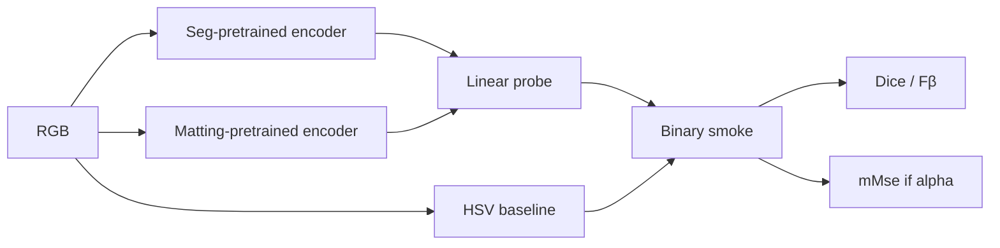

```mermaid
flowchart LR
  RGB[RGB] --> HSV[HSV baseline]
  RGB --> E1[Seg-pretrained encoder]
  RGB --> E2[Matting-pretrained encoder]
  E1 --> L[Linear probe]
  E2 --> L
  L --> Bin[Binary smoke]
  HSV --> Bin
  Bin --> Dice[Dice / Fβ]
  Bin --> MM[mMse if alpha]
```
