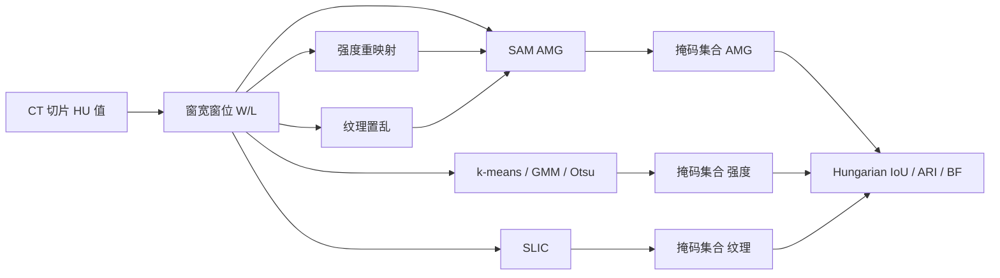

```mermaid
flowchart LR
  CT[CT 切片 HU 值] --> W[窗宽窗位 W/L]
  W --> SAM[SAM AMG]
  W --> KM[k-means / GMM / Otsu]
  W --> SP[SLIC]
  SAM --> M1[掩码集合 AMG]
  KM --> M2[掩码集合 强度]
  SP --> M3[掩码集合 纹理]
  M1 --> AGR[Hungarian IoU / ARI / BF]
  M2 --> AGR
  M3 --> AGR
  W --> CF1[强度重映射]
  W --> CF2[纹理置乱]
  CF1 --> SAM
  CF2 --> SAM
```
