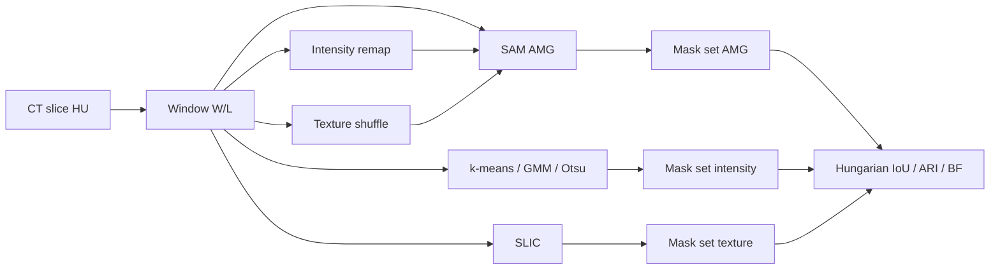

```mermaid
flowchart LR
  CT[CT slice HU] --> W[Window W/L]
  W --> SAM[SAM AMG]
  W --> KM[k-means / GMM / Otsu]
  W --> SP[SLIC]
  SAM --> M1[Mask set AMG]
  KM --> M2[Mask set intensity]
  SP --> M3[Mask set texture]
  M1 --> AGR[Hungarian IoU / ARI / BF]
  M2 --> AGR
  M3 --> AGR
  W --> CF1[Intensity remap]
  W --> CF2[Texture shuffle]
  CF1 --> SAM
  CF2 --> SAM
```
