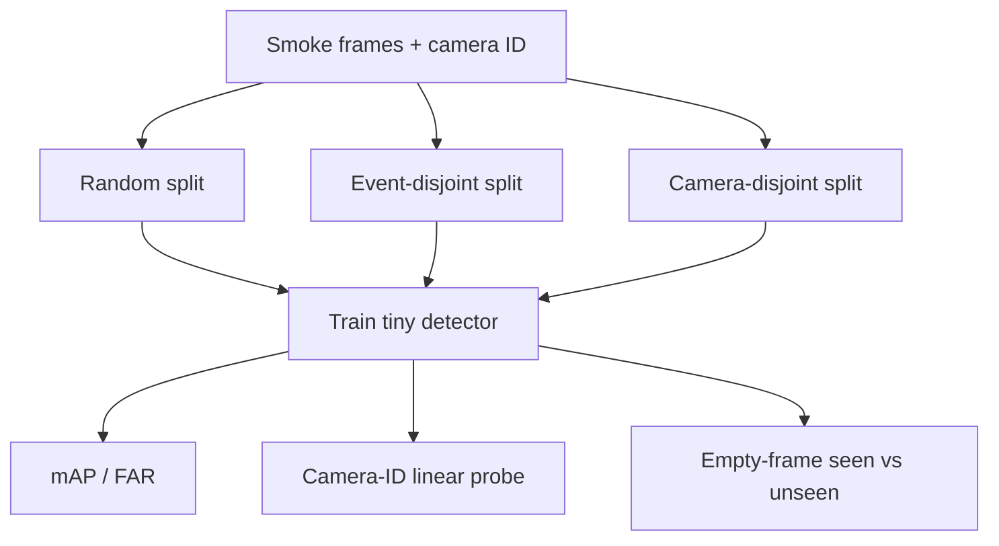

```mermaid
flowchart TB
  D[Smoke frames + camera ID] --> R[Random split]
  D --> E[Event-disjoint split]
  D --> C[Camera-disjoint split]
  R --> T[Train tiny detector]
  E --> T
  C --> T
  T --> M[mAP / FAR]
  T --> P[Camera-ID linear probe]
  T --> F[Empty-frame seen vs unseen]
```
