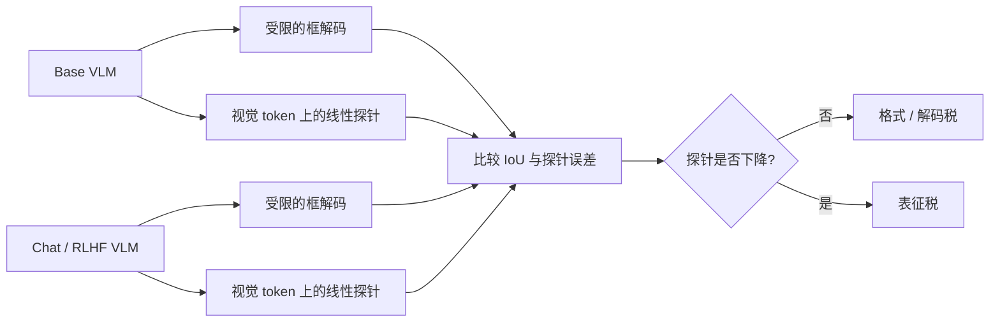

```mermaid
flowchart LR
  B[Base VLM] --> G1[受限的框解码]
  C[Chat / RLHF VLM] --> G2[受限的框解码]
  B --> P1[视觉 token 上的线性探针]
  C --> P2[视觉 token 上的线性探针]
  G1 --> CMP[比较 IoU 与探针误差]
  G2 --> CMP
  P1 --> CMP
  P2 --> CMP
  CMP --> F{探针是否下降?}
  F -->|否| FMT[格式 / 解码税]
  F -->|是| REP[表征税]
```
