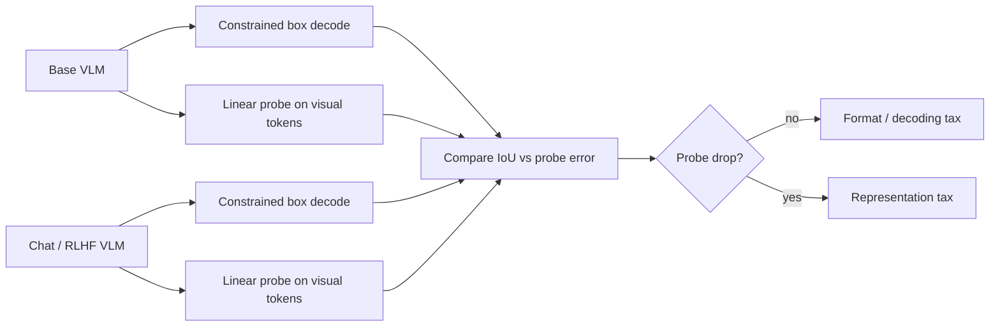

```mermaid
flowchart LR
  B[Base VLM] --> G1[Constrained box decode]
  C[Chat / RLHF VLM] --> G2[Constrained box decode]
  B --> P1[Linear probe on visual tokens]
  C --> P2[Linear probe on visual tokens]
  G1 --> CMP[Compare IoU vs probe error]
  G2 --> CMP
  P1 --> CMP
  P2 --> CMP
  CMP --> F{Probe drop?}
  F -->|no| FMT[Format / decoding tax]
  F -->|yes| REP[Representation tax]
```
