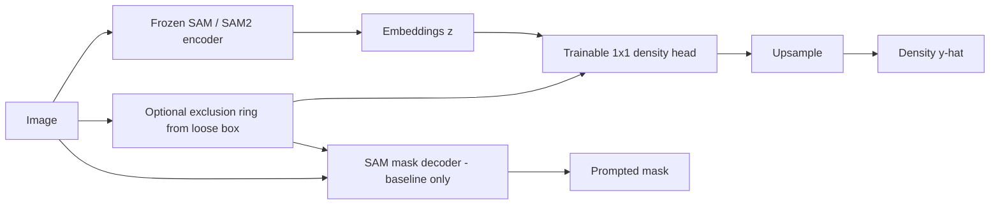
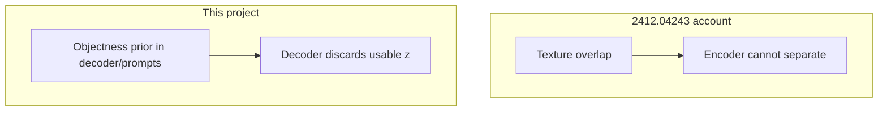

# Idea_01 architecture

```mermaid
flowchart LR
  img[Image] --> E[Frozen SAM / SAM2 encoder]
  E --> z[Embeddings z]
  z --> h[Trainable 1x1 density head]
  h --> up[Upsample]
  up --> yhat[Density y-hat]
  img --> P[Optional exclusion ring from loose box]
  P --> h
  img --> D[SAM mask decoder - baseline only]
  P --> D
  D --> ysam[Prompted mask]
```

Competing mechanism from prior work (not our method):

```mermaid
flowchart TB
  subgraph prior["2412.04243 account"]
    tex[Texture overlap] --> encFail[Encoder cannot separate]
  end
  subgraph ours["This project"]
    obj[Objectness prior in decoder/prompts] --> decFail[Decoder discards usable z]
  end
```
