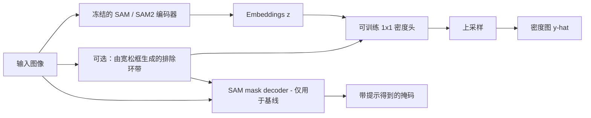
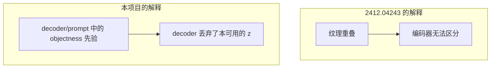

# Idea_01 架构

```mermaid
flowchart LR
  img[输入图像] --> E[冻结的 SAM / SAM2 编码器]
  E --> z[Embeddings z]
  z --> h[可训练 1x1 密度头]
  h --> up[上采样]
  up --> yhat[密度图 y-hat]
  img --> P[可选：由宽松框生成的排除环带]
  P --> h
  img --> D[SAM mask decoder - 仅用于基线]
  P --> D
  D --> ysam[带提示得到的掩码]
```

来自 prior work 的竞争性机制解释（不是我们的方法）：

```mermaid
flowchart TB
  subgraph prior["2412.04243 的解释"]
    tex[纹理重叠] --> encFail[编码器无法区分]
  end
  subgraph ours["本项目的解释"]
    obj[decoder/prompt 中的 objectness 先验] --> decFail[decoder 丢弃了本可用的 z]
  end
```
