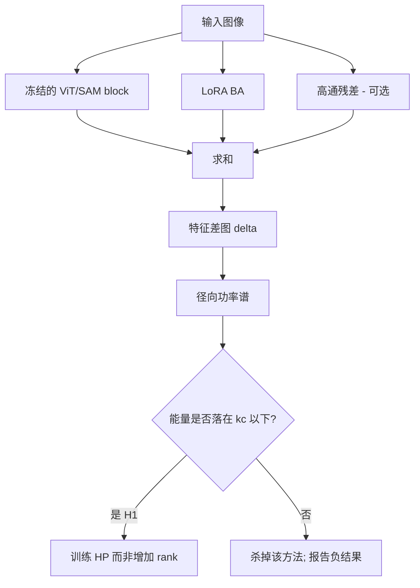

```mermaid
flowchart TB
  x[输入图像] --> W[冻结的 ViT/SAM block]
  x --> BA[LoRA BA]
  x --> HP[高通残差 - 可选]
  W --> add[求和]
  BA --> add
  HP --> add
  add --> d[特征差图 delta]
  d --> fft[径向功率谱]
  fft --> h1{能量是否落在 kc 以下?}
  h1 -->|是 H1| hpTrain[训练 HP 而非增加 rank]
  h1 -->|否| kill[杀掉该方法; 报告负结果]
```
