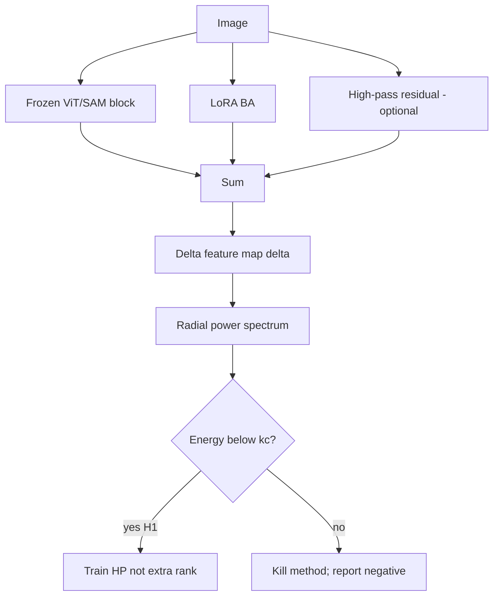

```mermaid
flowchart TB
  x[Image] --> W[Frozen ViT/SAM block]
  x --> BA[LoRA BA]
  x --> HP[High-pass residual - optional]
  W --> add[Sum]
  BA --> add
  HP --> add
  add --> d[Delta feature map delta]
  d --> fft[Radial power spectrum]
  fft --> h1{Energy below kc?}
  h1 -->|yes H1| hpTrain[Train HP not extra rank]
  h1 -->|no| kill[Kill method; report negative]
```
