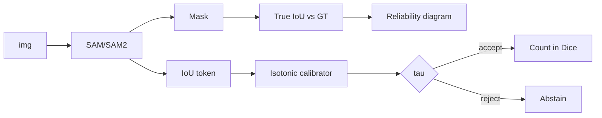

```mermaid
flowchart LR
  img --> SAM[SAM/SAM2]
  SAM --> mask[Mask]
  SAM --> s[IoU token]
  mask --> iou[True IoU vs GT]
  s --> cal[Isotonic calibrator]
  iou --> rel[Reliability diagram]
  cal --> gate{tau}
  gate -->|accept| keep[Count in Dice]
  gate -->|reject| abs[Abstain]
```
