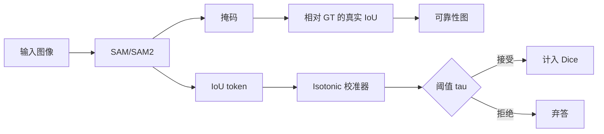

```mermaid
flowchart LR
  img[输入图像] --> SAM[SAM/SAM2]
  SAM --> mask[掩码]
  SAM --> s[IoU token]
  mask --> iou[相对 GT 的真实 IoU]
  s --> cal[Isotonic 校准器]
  iou --> rel[可靠性图]
  cal --> gate{阈值 tau}
  gate -->|接受| keep[计入 Dice]
  gate -->|拒绝| abs[弃答]
```
